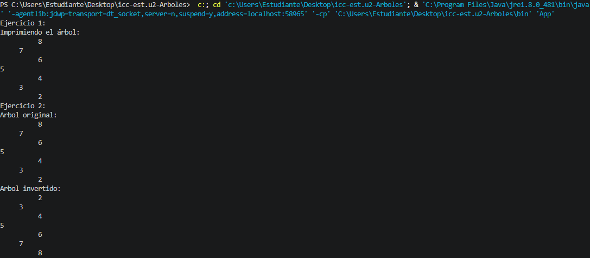

# Práctica: Árboles Binarios en Java

## Estudiante

* Nombre: Jorge Luis Padilla
* Carrera: Computación
* Asignatura: Estructura de Datos
* Profesor: Ing. Pablo Torres
* Grupo: 3

---

# Descripción general del proyecto

En esta práctica se implementó la estructura de datos Árbol Binario de Búsqueda (Binary Search Tree). Se desarrollaron clases genéricas y específicas (`BinaryTree<T>` e `IntTree`) para construir el árbol mediante la conexión de nodos (`Node<T>`). Se aplicó la recursividad para resolver problemas fundamentales como la inserción de datos, los diferentes tipos de recorridos (PreOrder, InOrder, PosOrder) y el cálculo de propiedades estructurales como la altura y el peso del árbol.

---

# Ejercicio 01: Implementación de Nodos e Inserción Recursiva

Se implementó la clase genérica `Node<T>` que almacena un valor y posee dos referencias (izquierda y derecha). A partir de esto, se creó la clase `BinaryTree<T>` con el método de inserción:

```java
public void insert(T value)

```

Este método permite agregar nuevos elementos manteniendo la propiedad de búsqueda del árbol (valores menores a la izquierda, mayores a la derecha) utilizando un enfoque recursivo.

### Código destacado

```java
// Recursivo para insertar valores en el ÁRBOL BINARIO
private Node<T> insertRecursivo(Node<T> actual, Node<T> nodeInsertar) {
    if (actual == null) {
        return nodeInsertar;
    }

    // Validar si es mayor o menor y decidir si lo ingreso a la der o izq
    if (actual.getValue().compareTo(nodeInsertar.getValue()) > 0) {
        actual.setLeft(insertRecursivo(actual.getLeft(), nodeInsertar));
    } else {
        actual.setRight(insertRecursivo(actual.getRight(), nodeInsertar));
    }

    return actual;
}

```

---

# Ejercicio 02: Recorridos del Árbol (PreOrder, InOrder, PosOrder)

Se implementaron los tres recorridos en profundidad clásicos para visitar los nodos del árbol. Estos métodos permiten iterar sobre la estructura en diferentes secuencias lógicas utilizando recursividad.

* **PreOrder:** Visita la raíz, luego el subárbol izquierdo y finalmente el derecho.
* **InOrder:** Visita el subárbol izquierdo, luego la raíz y finalmente el derecho (útil para obtener los elementos ordenados).
* **PosOrder:** Visita los subárboles izquierdo y derecho antes de procesar la raíz.

### Código de Recorridos (Ejemplo con InOrder y PreOrder)

```java
// InOrder
public void inOrder() {
    inOrderRecursivo(root);
}

private void inOrderRecursivo(Node<T> actual) {
    if (actual == null)
        return;
    inOrderRecursivo(actual.getLeft());
    System.out.println(actual + " ");
    inOrderRecursivo(actual.getRight());
}

// PreOrder
public void preOrder() {
    preOrderRecursivo(root);
}

private void preOrderRecursivo(Node<T> actual) {
    if (actual == null)
        return;
    System.out.print(actual + " ");
    preOrderRecursivo(actual.getLeft());
    preOrderRecursivo(actual.getRight());
}

```

---

# Ejercicio 03: Cálculo de Altura y Peso del Árbol

Para comprender la magnitud de la estructura de datos, se crearon métodos que calculan sus propiedades físicas:

* **Altura:** Retorna el nivel de profundidad máximo del árbol.
* **Peso (Cantidad de nodos):** Cuenta el total de elementos instanciados dentro del árbol binario.

Ambos métodos operan de forma recursiva sumando el resultado de las ramificaciones.

### Código

```java
// Altura
public int altura() {
    return alturaRecursivo(root);
}

private int alturaRecursivo(Node<T> actual) {
    if (actual == null)
        return 0;
    int alturaIzquierda = alturaRecursivo(actual.getLeft());
    int alturaDerecha = alturaRecursivo(actual.getRight());
    return Math.max(alturaIzquierda, alturaDerecha) + 1;
}

// Cantidad de nodos / Peso
public int peso() {
    return pesoRecursivo(root);
}

private int pesoRecursivo(Node<T> actual) {
    if (actual == null)
        return 0;
    int pesoIzquierdo = pesoRecursivo(actual.getLeft());
    int pesoDerecho = pesoRecursivo(actual.getRight());
    return pesoIzquierdo + pesoDerecho + 1;
}

```

---

# Ejecución desde App.java

La clase principal ejecuta las pruebas utilizando el modelo de datos `Person`. Al usar el árbol genérico `BinaryTree<Person>`, los elementos se organizan según su criterio de comparación (que debe estar definido en la interfaz `Comparable` de la clase `Person`).

### Código principal

```java
public class App {
    public static void main(String[] args) throws Exception {
        runPersonTree();
    }

    public static void runPersonTree() {
        BinaryTree<Person> personTree = new BinaryTree<>();
        personTree.insert(new Person("Alice", 30));
        personTree.insert(new Person("Bob", 25));
        personTree.insert(new Person("Diego", 35));
        personTree.insert(new Person("Rafael", 35));
        personTree.insert(new Person("Ana", 35));

        System.out.println("InOrder");
        personTree.inOrder();
        System.out.println("PreOrder");
        personTree.preOrder();
    }
}

```

### Salida por consola




# 2. Sets.java y Contacto.java

### Fecha: 24/06/26

## Descripción: 

En esta clase creamos dos proyectos uno llamado Sets y otro contacto, en Sets implementamos los Hash, HashSet, LinkedHashSet y SetTree, de los cuales comprobamos sus diferentes formas y caracteristicas que tiene cada uno haciendo varios cambios y usos.
En la clase Contacto creamos variables nombre, apellido y telefono en los cuales dando valores los metodos Set nos facilitaron tanto como para busqueda y comparacion.

## Codigo

```java
public Set<String> construirHashSet() {
        Set<String> hashSet = new HashSet<>();
        hashSet.add("A");
        hashSet.add("B");
        hashSet.add("C");
        hashSet.add("A");
        hashSet.add("D");
        hashSet.add("E");
        hashSet.add("F");
        hashSet.add("1Ggggggeegeg");
        hashSet.add("2G2gggggeegeg");
        hashSet.add("3Gggggeegeg");
        hashSet.add("4Ggggggeegeg");
        hashSet.add("5Ggggggeegeg");
        hashSet.add("5Ggggggeegeg");
        hashSet.add("6Ggggggeegeg");
        hashSet.add("G7gggggeegeg");
        return hashSet;
    }

    public Set<String> construirLinkedHashSet() {
        Set<String> linkedHashSet = new LinkedHashSet<>();
        linkedHashSet.add("A");
        linkedHashSet.add("B");
        linkedHashSet.add("C");
        linkedHashSet.add("A");
        linkedHashSet.add("D");
        linkedHashSet.add("E");
        linkedHashSet.add("F");
        linkedHashSet.add("1Ggggggeegeg");
        linkedHashSet.add("2G2gggggeegeg");
        linkedHashSet.add("3Gggggeegeg");
        linkedHashSet.add("4Ggggggeegeg");
        linkedHashSet.add("5Ggggggeegeg");
        linkedHashSet.add("5Ggggggeegeg");
        linkedHashSet.add("6Ggggggeegeg");
        linkedHashSet.add("G7gggggeegeg");
        return linkedHashSet;
    }

    public Set<String> construirTreeSet() {
        Set<String> treeSet = new TreeSet<>();
        treeSet.add("A");
        treeSet.add("B");
        treeSet.add("C");
        treeSet.add("A");
        treeSet.add("D");
        treeSet.add("E");
        treeSet.add("F");
        treeSet.add("1Ggggggeegeg");
        treeSet.add("2G2gggggeegeg");
        treeSet.add("3Gggggeegeg");
        treeSet.add("4Ggggggeegeg");
        treeSet.add("5Ggggggeegeg");
        treeSet.add("5Ggggggeegeg");
        treeSet.add("6Ggggggeegeg");
        treeSet.add("G7gggggeegeg");
        return treeSet;
    }

    public Set<Contacto> construirTreeSetConComparador() {
        Set<Contacto> tCSet = new TreeSet<>();
        tCSet.add(new Contacto("Juan", "Perez", "123456789"));
        tCSet.add(new Contacto("Ana", "Gomez", "987654321"));
        tCSet.add(new Contacto("Pedro", "Lopez", "456789123"));
        tCSet.add(new Contacto("Maria", "Rodriguez", "789123456"));
        tCSet.add(new Contacto("Juan", "Perez", "123456789")); // Duplicado, no se agregará
        tCSet.add(new Contacto("Juan", "Lopez", "123456789"));
        return tCSet;
    }

    public Set<Contacto> construirHashSetContacto() {
        Set<Contacto> hashSet = new HashSet<>();
        Contacto c1 = new Contacto("Juan", "Perez", "123456789");
        Contacto c2 = new Contacto("Ana", "Gomez", "987654321");
        Contacto c3 = new Contacto("Pedro", "Lopez", "456789123");
        Contacto c4 = new Contacto("Maria", "Rodriguez", "789123456");
        Contacto c5 = new Contacto("Juan", "Perez", "123456789"); // Duplicado, no se agregará
        Contacto c6 = new Contacto("Juan", "Lopez", "123456789");

        System.out.println("Contacto c1: " + c1.hashCode());
        System.out.println("Contacto c5: " + c2.hashCode());
        
        hashSet.add(c1);
        hashSet.add(c2);
        hashSet.add(c3);
        hashSet.add(c4);
        hashSet.add(c5);
        hashSet.add(c6);
        return hashSet;
    }
```
 ## Salida de consola

        

 # 3. Diccionario/Maps

### Fecha: 29/06/26

## Descripción: 

En esta clase implementamos Maps en el cual con la definicion de clave-valor se nos hizo mas facil ordenar y realizar busquedas con valores o clave la cual es unica e irrepetible, lo unico que se puede repetir es el valor.
Tambien comprobamos como funciona cada mapa con Hash, Linkedhash y Tree. Agregamos diferentes valores y quedo comprobado que la clave no se repite.

## Codigo

```java
public Map<String, Integer> construirHashMap() {
        Map<String, Integer> map = new HashMap<>();
        map.put("A", 10);
        map.put("B", 20);
        map.put("C", 30);
        map.put("A", 50);
        System.out.println("HashMap:");
        System.out.println(map.size());
        System.out.println(map);
        System.out.println(map.values().toArray());

        //Map--> V --> VALORES --> ARRAY --> ARRAY[pos] 
        for (int i = 0; i < map.size(); i++) {
            
            System.out.println(map.values().toArray()[i]);
        }

        //MAP --> K --> KEYS --> -.> SET --> valor del set
        for (String key : map.keySet()) {
            System.out.println(key);

        }//A, B, C

        //T =. ENTRY <K,V>
        //T = 
        // SET<T>

        map.entrySet();
        for(Map.Entry<String, Integer> entry : map.entrySet()) {
            System.out.println(entry);

        }
        return map;
    }

    public LinkedHashMap<String, Integer> construirLinkedHashMap() {
        LinkedHashMap<String, Integer> lmap = new LinkedHashMap<>();
        lmap.put("A", 2);
        lmap.put("B", 3);
        lmap.put("A", 5);
        lmap.put("C", 50);
        lmap.put("D", 5);
        lmap.put("F", 3);
        lmap.put("G", 8);
        lmap.put("H", 85);
        lmap.put("I", 5);
        System.out.println("LinkedHashMap:");
        System.out.println(lmap.size());
        System.out.println(lmap);
        System.out.println(lmap.entrySet());
        return lmap;

    }

    public TreeMap<String, Integer> cTreeMap() {
        TreeMap<String, Integer> tmap = new TreeMap<>();
        tmap.put("A", 2);
        tmap.put("B", 3);
        tmap.put("A", 5);
        tmap.put("C", 50);
        tmap.put("D", 5);
        tmap.put("F", 3);
        tmap.put("G", 8);
        tmap.put("H", 85);
        tmap.put("I", 5);
        System.out.println("TreeMap:");
        System.out.println(tmap.size());
        System.out.println(tmap);
        System.out.println(tmap.entrySet());
        return tmap;

    }
```
 ## Salida de consola


  # 4. Graphs

### Fecha: 1/07/26

## Descripción: 

En una clase Graph.java creamos y usamos grafos con ayuda de nodos, mapas y los HashSet, con unos simples get y add hicimos uniones con letras, ordenando y dejando el codigo limpio.

## Codigo

```java
    public class Graph<T> {
    //COLLECTION DE NODOS
    //SET HASH SET TREE SET
    //MAP HASH MAP TREE MAP
    private Map<Node<T>, Set<Node<T>>> graph;
    
    public Graph(){
        this.graph = new HashMap<Node<T>, Set<Node<T>>>();
        Map<Node<T>, Set<Node<T>>> g2 = new HashMap<Node<T>, Set<Node<T>>>();

        for (Node<T> node : graph.keySet()) {
            g2.put(node, graph.get(node));
        }
    }

    public void add(T data) {
        Node<T> node = new Node<>(data);
        graph.putIfAbsent(node, new HashSet<Node<T>>());
    }

    public void addEdge(T v1, T v2) {
        Node<T> nv1 = new Node<T>(v1);
        Node<T> nv2 = new Node<T>(v2);
        add(v1);
        add(v2);
        graph.get(nv1).add(nv2);
        graph.get(nv2).add(nv1);

    }

    public void addEdgeUni(T v1, T v2) {
        Node<T> nv1 = new Node<T>(v1);
        Node<T> nv2 = new Node<T>(v2);
        add(v1);
        add(v2);
        graph.get(nv1).add(nv2);
    }

    public void printGraph() {
        for (Map.Entry<Node<T>, Set<Node<T>>> entry : graph.entrySet()) {
            System.out.print(entry.getKey() + " -> ");
            for (Node<T> conneccion : entry.getValue()) {
                System.out.print(conneccion);
            }
            System.out.println();
        }
    }
```

## Salida de consola
